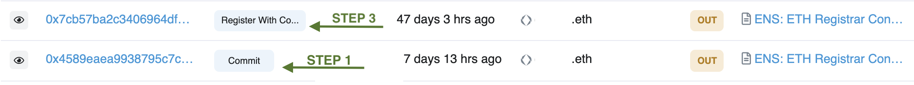

# Why isn't my ENS Name in my wallet?

Please verify that your registration was successful please by checking your transaction history on [Etherscan.io](https://www.etherscan.io). Successful registrations will see two transactions: `Commit` **and** `Register with Config`. These transactions represent the Step 1 and Step 3 of the ENS registration process.

## Troubleshooting Checklist

1.  **Check your  address on** [**Etherscan.io**](https://www.etherscan.io)**.**

    Query the wallet address that was used to register an Ethereum Name.

    _If your address does not show any registration transactions proceed to_ [#wrong-address](why-isnt-my-ens-name-in-my-wallet.md#wrong-address "mention")__

2.  **Ensure Step 1 of registration is completed.**

    Look for a transaction with the method of `Commit`. This transaction should be present and have interacted with the [ENS Registrar Controller.](https://etherscan.io/address/0x283af0b28c62c092c9727f1ee09c02ca627eb7f5)__

    _If the `Commit` transaction is not present, proceed to_ [#registration-incomplete.](why-isnt-my-ens-name-in-my-wallet.md#registration-incomplete. "mention")__

    _If you did not interact with the ENS Registrar, proceed to_ [#fraudulent-activity](why-isnt-my-ens-name-in-my-wallet.md#fraudulent-activity "mention")__

3.  **Ensure Step 3 of registration is completed.**

    Look for a transaction with the method of `Register With Config` present. This transaction should be present and have interacted with the [ENS Registrar Controller.](https://etherscan.io/address/0x283af0b28c62c092c9727f1ee09c02ca627eb7f5)

    _If the `Register With Config` transaction is not present, proceed to_ [#registration-incomplete.](why-isnt-my-ens-name-in-my-wallet.md#registration-incomplete. "mention")__

    _If you did not interact with the ENS Registrar, proceed to_ [#fraudulent-activity](why-isnt-my-ens-name-in-my-wallet.md#fraudulent-activity "mention")__

## Registration Errors

### Wrong Address

You mistakenly registered your name to another wallet that you own.

**Corrective Action:** _Connect the correct wallet to the ENS Application. If your ENS name was mistakenly registered to another address you own, you can transfer the name by changing the Registrant. If you do not need to migrate it to a new wallet, you also can point your ENS to any wallet address by setting the Controller._

__

### Registration **Incomplete**.

One of the steps was missed or not completed. You must complete all the steps to register your ENS name fully.&#x20;

.png>)

**Corrective Action:** _You must complete all the steps to register your ENS name._ See [registering-a-name.md](../../ens-explainers/registering-a-name.md "mention") to review the registration process. _Remember, you have seven days after the second transaction to complete Step 3._

__

### Fraudulent Activity

If you did not interact with the ENS Registrar Controller, you likely transacted with a malicious registration contract. Verify that your registration occurred at the official website, [https://app.ens.domains/](https://app.ens.domains).&#x20;

**Corrective Action:** _Open a ticket at our official Discord to report any fraudulent activity or phishing attempts. It is important to verify the details of all signature requests and contract calls before accepting them._

