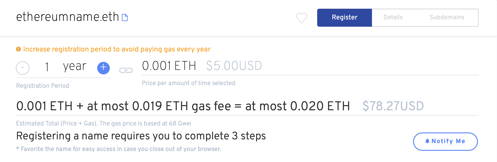

# How much does it cost to register an ENS Name?

### Domain Registration Costs

* **5+ Characters:** $5/year + plus gas fee.
* **4 Character Domains:** $160/year + plus gas fee.
* **3 Character Domains:** $640/year + plus gas fee.

_\*Registration costs displayed in USD. All transactions are paid in Ether (Ξ)._

### Pricing Explained

The Ethereum Name service pricing is structured to deter domain squatting.

Three and four character names have "premium" pricing to reflect the small number of these names available. If a name was recently released from the expiration grace period, a decaying price premium is also applied.

Learn More: [what-is-a-grace-period.md](what-is-a-grace-period.md "mention")

### Estimated Price on ENS Manager

Our app will provide an estimated the cost based upon current gas fees. Your actual registration cost may be higher or lower due to the fluctuating gas prices.

The price displayed is a conservative estimate to ensure the user has the necessary amount of Ether in their wallet. Actual gas prices will vary and are often lower. Check your wallet settings to ensure you are paying the optimal amount.

### More about Gas Fees

All transactions on the Ethereum blockchain incur a gas fee in addition to the registration fees. We recommend increasing the registration period to avoid paying gas every year.

&#x20;Learn More: [what-are-gas-fees.md](../wallets/what-are-gas-fees.md "mention")
